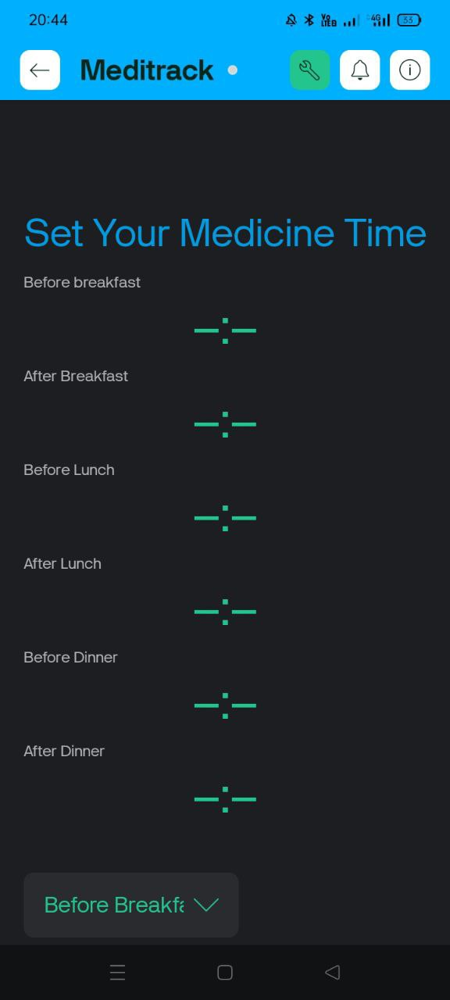
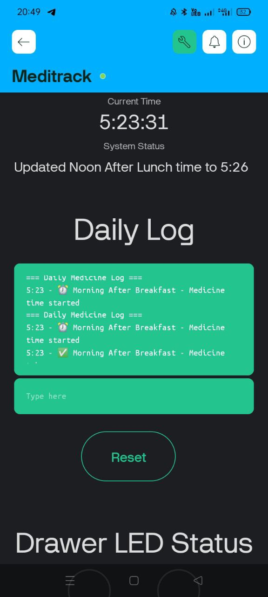

# 💊 MediTrack: Smart Medicine Box with IoT Integration

A complete IoT solution for medication management using ESP32, designed to help patients and caregivers track medicine intake with real-time notifications and comprehensive logging.

  

## 🌟 Features

### 📱 Mobile App Control
- **Remote Time Setting**: Configure medicine schedules from anywhere using time input widgets
- **Real-time Status Monitoring**: View current medicine schedule and taken status
- **Push Notifications**: Instant alerts for medicine time reminders
- **Complete Activity Log**: Detailed history with timestamps
- **Current Time Display**: Check RTC time remotely with a button press

### ⏰ Smart Scheduling
- **6 Customizable Time Slots**: Perfect for multiple daily medications
  - Morning Before/After Breakfast
  - Noon Before/After Lunch  
  - Night Before/After Dinner
- **Automatic Reminders**: Red LED + buzzer alerts at scheduled times
- **Daily Reset**: Automatic schedule reset at midnight
- **Green LED Confirmation**: 10-minute confirmation when medicine is taken

### 🔔 Intelligent Notifications
- 🕐 **Medicine Time Alert**: Red LED + buzzer when it's time to take medication
- ✅ **Confirmation**: Green LED when medicine is successfully taken
- 📱 **Blynk Events**: Push notifications sent to your mobile device

### 📊 Health Tracking
- **Daily Intake Logging**: Complete record of all medication activities
- **Status Monitoring**: Track which medicines have been taken
- **Historical Data**: Perfect for sharing with healthcare providers
- **Manual Reset**: Clear daily logs and reset status anytime

## 🔧 Hardware Requirements

### Main Components
| Component | Quantity | Purpose |
|-----------|----------|---------|
| ESP32 Development Board | 1 | Main controller with WiFi |
| DS3231 RTC Module | 1 | Real-time clock for accurate timing |
| Reed Switches | 6 | Detect drawer opening (magnetic sensors) |
| Red LEDs | 6 | Medicine time indicators |
| Green LEDs | 6 | Medicine taken confirmation |
| Buzzer | 1 | Audio alerts |
| Resistors (220Ω) | 12 | LED current limiting |
| Pull-up Resistors (10kΩ) | 4 | For input-only GPIO pins (34-39) |

### Pin Connections

```
ESP32 Pin Assignments:
├── Reed Switches (INPUT): 2, 4, 34, 35, 36, 39
├── Red LEDs (OUTPUT): 12, 13, 14, 25, 26, 27  
├── Green LEDs (OUTPUT): 32, 33, 15, 16, 17, 23
├── Buzzer (OUTPUT): 19
└── I2C (RTC): SDA-21, SCL-22
```

### Circuit Notes
- **GPIO 34-39**: Input-only pins, require external 10kΩ pull-up resistors
- **GPIO 2, 4**: Use internal pull-up resistors (INPUT_PULLUP)
- **RTC Module**: Connect VCC to 3.3V, GND to GND
- **LEDs**: Use 220Ω current-limiting resistors

### Block Diagram

.jpg>)

## 📚 Software Dependencies

### Arduino Libraries
Install these libraries through Arduino IDE Library Manager:

```cpp
// Core Libraries
#include <WiFi.h>           // ESP32 WiFi (built-in)
#include <Wire.h>           // I2C communication (built-in)

// External Libraries (install via Library Manager)
#include <RTClib.h>         // by Adafruit
#include <BlynkSimpleEsp32.h> // by Volodymyr Shymanskyy
```

### Installation Steps
```bash
# In Arduino IDE:
Tools → Manage Libraries → Search and Install:
- "RTClib" by Adafruit
- "Blynk" by Volodymyr Shymanskyy
```

## ⚙️ Setup Instructions

### 1. Hardware Assembly
1. Connect components according to pin diagram above
2. Install ESP32 in breadboard/PCB
3. Connect RTC module via I2C (SDA-21, SCL-22)
4. Wire reed switches:
   - Pins 2, 4: Direct connection (uses INPUT_PULLUP)
   - Pins 34-39: External 10kΩ pull-up resistors required
5. Connect LEDs with 220Ω current-limiting resistors
6. Add buzzer to pin 19

### 2. Blynk Configuration

#### Create Blynk Template
1. Go to [console.blynk.cloud](https://console.blynk.cloud)
2. Create new template: **"MediTrack"** 
3. Hardware: **ESP32**, Connection: **WiFi**
4. Copy your **Template ID**

#### Configure Datastreams
Add these Virtual Pins in your Blynk template:

| Pin | Name | Type | Purpose |
|-----|------|------|---------|
| V0 | Morning Before Time | String | Time input widget |
| V1 | Morning After Time | String | Time input widget |
| V2 | Noon Before Time | String | Time input widget |
| V3 | Noon After Time | String | Time input widget |
| V4 | Night Before Time | String | Time input widget |
| V5 | Night After Time | String | Time input widget |
| V6 | Medicine Log | String | Log display |
| V7 | Reset Log | Integer | Reset button |
| V8 | Status Display | String | Current status |
| V9 | Current Time Button | Integer | Get time button |
| V10 | Current Time Display | String | Time display |

#### Create Device
1. Go to **Devices** tab
2. Create **"New Device"** from template
3. Copy **Auth Token** for Arduino code

#### Setup Events
Create event for notifications:
- **Event Name**: `medicine_reminder`
- **Description**: Medicine reminder notification

### 3. Mobile App Setup

#### Download Blynk IoT App
- **Android**: Google Play Store
- **iOS**: App Store
- Search for **"Blynk IoT"** (NOT Blynk Legacy)

#### Add Widgets
| Widget Type | Virtual Pin | Configuration |
|-------------|-------------|---------------|
| Time Input | V0-V5 | Medicine schedule times (24H format) |
| Label | V8 | Current medicine status |
| Label | V6 | Medicine intake log |
| Button | V7 | Reset daily log (Push mode) |
| Button | V9 | Show current time (Push mode) |
| Label | V10 | Current time display |

### 4. Code Configuration

Update these credentials in `MediTrack.ino`:

```cpp
// Blynk Credentials (from Blynk Console)
#define BLYNK_TEMPLATE_ID "Template_ID"      // Your Template ID
#define BLYNK_TEMPLATE_NAME "Template_name"  // Your Template Name  
#define BLYNK_AUTH_TOKEN "Auth_token"        // Your Device Auth Token

// WiFi Credentials
char ssid[] = "wifi_name";                   // Your WiFi SSID
char pass[] = "wifi_password";               // Your WiFi Password
```

### 5. Upload and Test
1. Select **ESP32 Dev Module** in Arduino IDE
2. Upload code to ESP32
3. Open Serial Monitor (115200 baud)
4. Look for these messages:
   - "Current RTC time: ..."
   - "Smart Medicine Box Started!"
   - "Connected to Blynk!"

## 🚀 Usage Guide

### Initial Setup
1. **Set Medicine Times**: Use time input widgets in Blynk app (format: HH:MM)
2. **Verify Connection**: Check device shows "Online" in Blynk console
3. **Test Current Time**: Press "Show Current Time" button to verify RTC
4. **Enable Notifications**: Allow push notifications in phone settings

### Daily Operation

#### Medicine Time Sequence
1. **Alert Phase**: Red LED turns on + buzzer beeps every second
2. **Taking Medicine**: Open drawer (reed switch detects opening)
3. **Confirmation**: Red LED/buzzer stop, Green LED turns on for 10 minutes
4. **Logging**: Activity automatically logged with timestamp

#### Mobile App Features
- **📅 Schedule Management**: Set/modify medicine times remotely
- **📊 Real-time Status**: View which medicines are taken/scheduled
- **📝 Activity Logging**: Complete history with timestamps
- **🔔 Smart Notifications**: Push notifications for medicine time
- **⏰ Time Verification**: Check current RTC time anytime

### Understanding LED Status
| Color | Meaning | Duration |
|-------|---------|----------|
| ⚫ Off | Normal state | - |
| 🔴 Red | Medicine time - take now! | Until drawer opened |
| 🟢 Green | Medicine taken - confirmed | 10 minutes |

### Reed Switch Logic
- **Drawer Closed**: Magnet close to reed switch = LOW
- **Drawer Open**: Magnet away from reed switch = HIGH (triggers medicine taken)

## 📱 Mobile App Interface

### Dashboard Layout
 


## 📊 Sample Log Output

```
=== Daily Medicine Log ===
1. Morning Before taken at 8:02
2. Morning After taken at 8:32
3. Noon Before taken at 12:01
4. Noon After taken at 12:31
5. Night Before taken at 18:02
6. Night After taken at 19:15
```

## 🔧 Troubleshooting

### Common Issues & Solutions

#### Device Won't Connect to WiFi
```cpp
// Check Serial Monitor:
Serial.println("Current RTC time: ..."); // Should show current time
// Verify:
- WiFi SSID and password are correct
- Using 2.4GHz network (ESP32 doesn't support 5GHz)
- Network has internet access
```

#### Blynk Connection Failed  
```cpp
// Verify in code:
- Template ID matches Blynk Console exactly
- Auth Token is from Device tab (not Template)
- Device shows "Online" in Blynk Console
```

#### RTC Not Working
```cpp
// Check Serial Monitor:
"Current RTC time: 2025/8/22 14:30:25" // Should show reasonable time

// If time is wrong:
- RTC module needs backup battery (CR2032)
- Check I2C connections (SDA=21, SCL=22)
- Verify 3.3V power (not 5V)
```

#### Reed Switches Not Responding
```cpp
// For different pin types:
GPIO 2, 4:     pinMode(pin, INPUT_PULLUP);  // Built-in pull-up
GPIO 34-39:    pinMode(pin, INPUT);         // External 10kΩ pull-up required

// Check magnet alignment and distance
```

#### Medicine Time Not Triggering
```cpp
// Debug steps:
1. Check current time: Press "Show Current Time" button
2. Set test time 2 minutes in future
3. Watch Serial Monitor for:
   "MEDICINE TIME TRIGGERED for Morning Before"
```

### Debug Serial Messages
Monitor these in Serial Monitor (115200 baud):
```
✓ "Current RTC time: 2025/8/22 14:30:25" - RTC working
✓ "Smart Medicine Box Started!" - Setup complete
✓ "Connected to Blynk!" - Blynk connected
✓ "Current time: 14:30:25" - Printed every 30 seconds
✓ "MEDICINE TIME TRIGGERED for Morning Before" - Alert activated
✓ "Morning Before taken at 14:32" - Medicine logged
```

## 🔮 Key Code Features

### Automatic Time Setting
- RTC automatically set to compile time on first run
- Handles power loss recovery
- Manual time adjustment capability

### Smart Pin Handling
- Automatic INPUT_PULLUP for GPIO 2, 4
- INPUT mode for GPIO 34-39 (input-only pins)
- Proper reed switch logic for all pin types

### Efficient Time Parsing
- Handles time input widgets that send seconds since midnight
- Converts to hours and minutes automatically
- Validates time ranges (0-23 hours, 0-59 minutes)

### Robust Buzzer Control
- Buzzer beeps every second when any alarm is active
- Stops immediately when medicine is taken
- No interference between multiple active alarms

### Enhanced Debugging
- Current time printed every 30 seconds
- Schedule checking debug every minute
- Detailed logging for troubleshooting

## 🤝 Contributing

### Development Setup
```bash
git clone https://github.com/yourusername/meditrack.git
cd meditrack
# Open MediTrack.ino in Arduino IDE
```

### Code Structure
- `setup()` - Initialize hardware and connections
- `loop()` - Main execution cycle
- `checkMedicineTime()` - Handle scheduling logic
- `checkDrawerStatus()` - Monitor reed switches
- `parseTime()` - Process time input from Blynk
- `updateBlynkStatus()` - Update mobile app display

## 📞 Support & Documentation

### Helpful Resources
- **Blynk Documentation**: [docs.blynk.cloud](https://docs.blynk.cloud)
- **ESP32 Reference**: [docs.espressif.com](https://docs.espressif.com)
- **RTClib Guide**: [learn.adafruit.com](https://learn.adafruit.com/adafruit-pcf8523-real-time-clock)

### Getting Help
- Check Serial Monitor output first
- Verify hardware connections match pin assignments
- Test individual components before full system
- Use Blynk console to monitor device status

---

**⭐ Star this repo if it helps you manage medications better!**

**Made with ❤️ for better healthcare management**